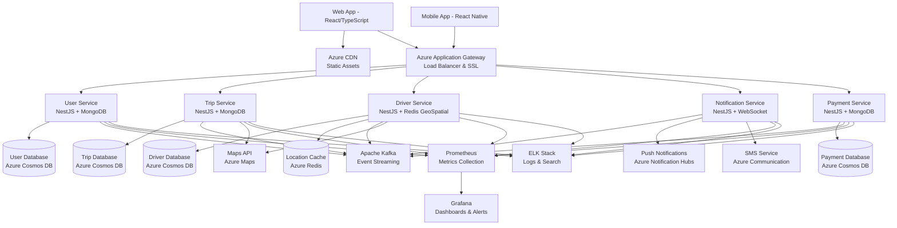
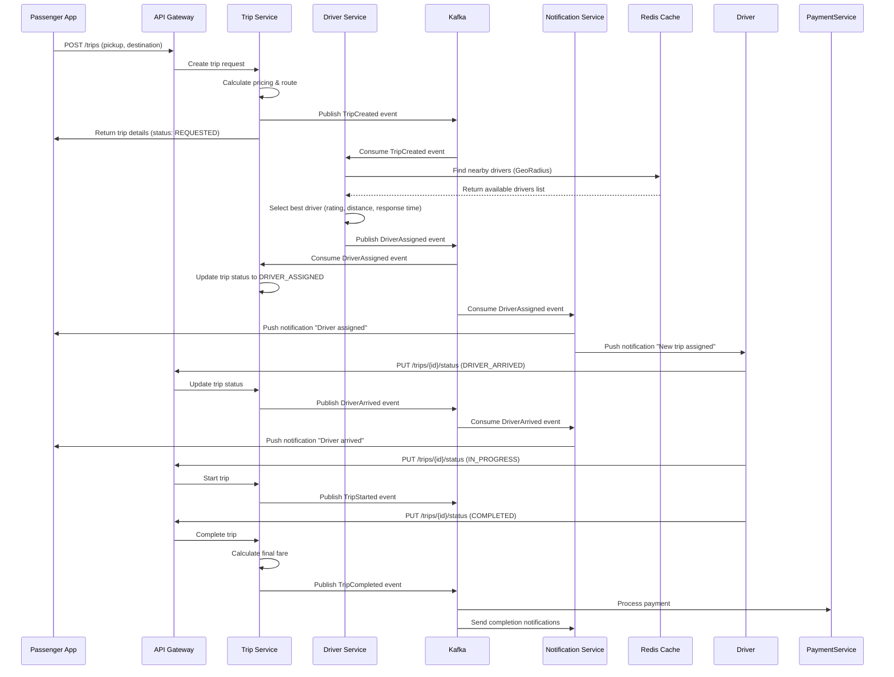
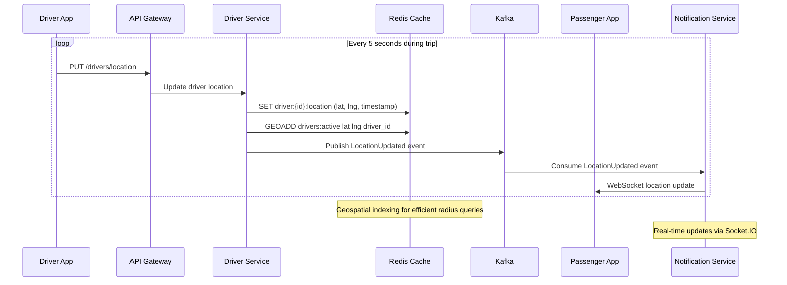
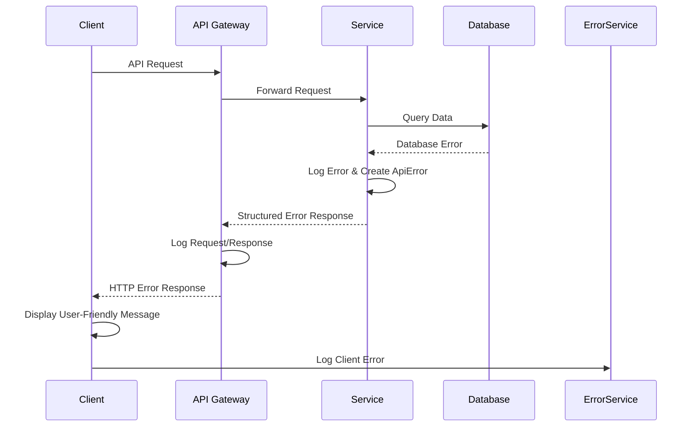
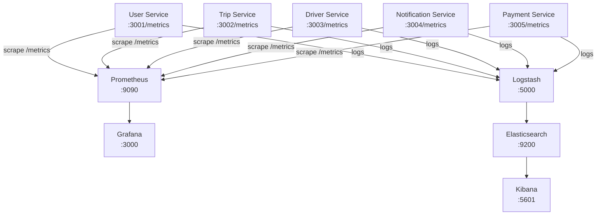

# UIT-Go Fullstack Architecture Document

## Introduction

This document outlines the complete fullstack architecture for UIT-Go, including backend microservices systems, frontend implementation, and their integration. It serves as the single source of truth for AI-driven development, ensuring consistency across the entire technology stack.

This unified approach combines what would traditionally be separate backend and frontend architecture documents, streamlining the development process for modern fullstack applications where these concerns are increasingly intertwined.

### Starter Template or Existing Project
N/A - Greenfield project

### Change Log
| Date | Version | Description | Author |
|------|---------|-------------|---------|
| 2025-09-27 | 1.0 | Initial architecture document | Winston (Architect) |

## High Level Architecture

### Technical Summary
UIT-Go employs a cloud-native microservices architecture deployed on Azure Container Apps with a modern TypeScript/JavaScript full-stack approach. The backend utilizes NestJS microservices orchestrated through Nx monorepo tooling, with MongoDB databases and Prisma ORM for data persistence. Real-time communication is handled via Apache Kafka for reliable message brokering between services, while Redis provides high-performance geospatial queries for driver location services. The frontend leverages React with TypeScript for type safety and maintainable code. The entire system is containerized with Docker, enabling seamless local development through Docker Compose and production deployment via Azure Container Apps with automated CI/CD pipelines through GitHub Actions and Azure Container Registry.

### Platform and Infrastructure Choice

**Platform:** Microsoft Azure
**Key Services:** Azure Container Apps, Azure Container Registry, Azure Cosmos DB (MongoDB API), Azure Cache for Redis, Azure Application Gateway, Azure Monitor
**Deployment Host and Regions:** East US, Southeast Asia for global coverage

**Rationale:** Azure provides excellent container orchestration with Azure Container Apps, managed MongoDB through Cosmos DB with MongoDB API for seamless Prisma integration, and robust CI/CD integration with GitHub Actions. The student-friendly pricing and comprehensive monitoring make it ideal for educational projects with production-quality infrastructure.

### Repository Structure

**Structure:** Nx Monorepo
**Monorepo Tool:** Nx Workspace
**Package Organization:** Microservices as separate apps, shared libraries for common code, frontend as separate app

### High Level Architecture Diagram



### Architectural Patterns

- **Microservices Architecture:** Domain-driven service boundaries with independent deployments - _Rationale:_ Enables independent scaling, technology choices, and team autonomy while managing complexity of ride-sharing domain
- **Event-Driven Architecture:** Apache Kafka for asynchronous communication between services - _Rationale:_ Decouples services, enables real-time features, and provides audit trail for business events
- **Database per Service:** Each microservice owns its data store - _Rationale:_ Ensures service independence, prevents coupling through shared databases, enables optimal storage choices per domain
- **API Gateway Pattern:** Azure Application Gateway as single entry point - _Rationale:_ Centralized authentication, rate limiting, SSL termination, and request routing
- **CQRS Pattern:** Separate read/write models for complex trip state management - _Rationale:_ Optimizes performance for different access patterns and supports event sourcing
- **Repository Pattern:** Abstract data access logic with Prisma - _Rationale:_ Enables testing, maintains clean architecture, and provides database abstraction
- **Saga Pattern:** Distributed transaction management for trip booking workflow - _Rationale:_ Ensures data consistency across services without tight coupling

## Tech Stack

This is the DEFINITIVE technology selection for the entire project. This table is the single source of truth - all development must use these exact versions.

### Technology Stack Table

| Category | Technology | Version | Purpose | Rationale |
|----------|------------|---------|---------|-----------|
| Frontend Language | TypeScript | 5.2+ | Type-safe frontend development | Prevents runtime errors, improves developer experience, enables better tooling |
| Frontend Framework | React | 18.2+ | UI component framework | Large ecosystem, excellent TypeScript support, proven at scale |
| UI Component Library | Ant Design | 5.x | Pre-built UI components | Comprehensive component set, good mobile support, consistent design system |
| State Management | Zustand | 4.x | Lightweight state management | Simple API, TypeScript-first, minimal boilerplate compared to Redux |
| Backend Language | TypeScript/Node.js | 20.x LTS | Server-side development | Shared language with frontend, excellent NestJS support, mature ecosystem |
| Backend Framework | NestJS | 10.x | Enterprise Node.js framework | Built-in microservices support, dependency injection, excellent TypeScript integration |
| Monorepo Tool | Nx | 17.x | Monorepo management | Best-in-class NestJS support, code generation, intelligent builds |
| API Style | REST + GraphQL | - | Hybrid API approach | REST for simple CRUD, GraphQL for complex queries and real-time subscriptions |
| Database | MongoDB | 7.x | Primary data store | Flexible schema, excellent scaling, Prisma support, Azure Cosmos DB compatibility |
| ORM/ODM | Prisma | 5.x | Database abstraction layer | Type-safe database access, great MongoDB support, code generation |
| Cache | Redis | 7.x | High-performance caching | Geospatial queries for driver location, session storage, pub/sub capabilities |
| Message Broker | Apache Kafka | 3.5+ | Event streaming platform | High throughput, durability, exactly-once delivery semantics |
| File Storage | Azure Blob Storage | - | Object storage | Cost-effective, CDN integration, secure access patterns |
| Authentication | JWT + Azure AD B2C | - | User authentication | Industry standard tokens, managed identity service, social login support |
| Frontend Testing | Jest + Testing Library | Latest | Unit & integration testing | React-focused testing utilities, excellent mocking capabilities |
| Backend Testing | Jest + Supertest | Latest | API testing | NestJS integration, HTTP assertion testing, async/await support |
| E2E Testing | Playwright | Latest | End-to-end testing | Cross-browser support, reliable selectors, Azure DevOps integration |
| Build Tool | Nx | 17.x | Build orchestration | Intelligent builds, dependency graph, caching |
| Bundler | Webpack | 5.x | Module bundling | Battle-tested, extensive plugin ecosystem, code splitting |
| Containerization | Docker | 24.x | Application containerization | Industry standard, Azure Container Apps native support |
| IaC Tool | Terraform | 1.6+ | Infrastructure as Code | Azure provider maturity, state management, reproducible deployments |
| CI/CD | GitHub Actions | - | Continuous integration | Free for public repos, excellent Azure integration, marketplace ecosystem |
| Container Registry | Azure Container Registry | - | Docker image registry | Native Azure integration, security scanning, geo-replication |
| Orchestration | Azure Container Apps | - | Container orchestration | Serverless containers, auto-scaling, managed service |
| Monitoring | Prometheus + Grafana | 2.45+ / 10.x | Application monitoring | Time-series metrics collection, powerful visualization, open-source flexibility |
| Logging | Winston + ELK Stack | Latest | Centralized logging | Structured logging, Elasticsearch queries, Kibana dashboards |
| CSS Framework | Tailwind CSS | 3.x | Utility-first CSS | Rapid development, consistent design system, small bundle size |

## Data Models

### User Model

**Purpose:** Represents both passengers and drivers in the system, with role-based differentiation and shared authentication/profile data.

**Key Attributes:**
- id: string - Unique user identifier (MongoDB ObjectId)
- email: string - User's email address (unique)
- password: string - Hashed password for authentication
- role: UserRole - PASSENGER | DRIVER enum
- profile: UserProfile - Embedded profile information
- status: UserStatus - ACTIVE | SUSPENDED | PENDING_VERIFICATION
- createdAt: Date - Account creation timestamp
- updatedAt: Date - Last profile update timestamp

#### TypeScript Interface
```typescript
interface User {
  id: string;
  email: string;
  password: string; // Never exposed to frontend
  role: UserRole;
  profile: UserProfile;
  status: UserStatus;
  createdAt: Date;
  updatedAt: Date;
}

interface UserProfile {
  firstName: string;
  lastName: string;
  phone: string;
  avatar?: string;
  // Driver-specific fields (optional)
  licenseNumber?: string;
  vehicleInfo?: VehicleInfo;
  rating?: number;
  totalTrips?: number;
}

enum UserRole {
  PASSENGER = 'PASSENGER',
  DRIVER = 'DRIVER'
}

enum UserStatus {
  ACTIVE = 'ACTIVE',
  SUSPENDED = 'SUSPENDED',
  PENDING_VERIFICATION = 'PENDING_VERIFICATION'
}
```

#### Relationships
- One-to-many with Trip (as passenger or driver)
- One-to-many with Rating (as rater or ratee)

### Trip Model

**Purpose:** Central entity representing a ride request/booking with complete state management from creation to completion.

**Key Attributes:**
- id: string - Unique trip identifier
- passengerId: string - Reference to passenger User
- driverId: string - Reference to driver User (nullable until assigned)
- status: TripStatus - Current trip state
- route: RouteInfo - Pickup and destination details
- pricing: PricingInfo - Cost calculation and payment details
- timeline: TripTimeline - Important timestamps
- metadata: TripMetadata - Additional trip information

#### TypeScript Interface
```typescript
interface Trip {
  id: string;
  passengerId: string;
  driverId?: string;
  status: TripStatus;
  route: RouteInfo;
  pricing: PricingInfo;
  timeline: TripTimeline;
  metadata: TripMetadata;
  createdAt: Date;
  updatedAt: Date;
}

interface RouteInfo {
  pickup: LocationPoint;
  destination: LocationPoint;
  estimatedDistance: number; // in meters
  estimatedDuration: number; // in seconds
  actualDistance?: number;
  actualDuration?: number;
}

interface LocationPoint {
  latitude: number;
  longitude: number;
  address: string;
  placeId?: string;
}

interface PricingInfo {
  baseFare: number;
  distanceFare: number;
  timeFare: number;
  totalFare: number;
  currency: string;
  paymentStatus: PaymentStatus;
}

interface TripTimeline {
  requestedAt: Date;
  driverAssignedAt?: Date;
  driverArrivedAt?: Date;
  tripStartedAt?: Date;
  tripCompletedAt?: Date;
  cancelledAt?: Date;
}

enum TripStatus {
  REQUESTED = 'REQUESTED',
  DRIVER_ASSIGNED = 'DRIVER_ASSIGNED', 
  DRIVER_ARRIVED = 'DRIVER_ARRIVED',
  IN_PROGRESS = 'IN_PROGRESS',
  COMPLETED = 'COMPLETED',
  CANCELLED = 'CANCELLED'
}

enum PaymentStatus {
  PENDING = 'PENDING',
  PROCESSING = 'PROCESSING',
  COMPLETED = 'COMPLETED',
  FAILED = 'FAILED',
  REFUNDED = 'REFUNDED'
}
```

#### Relationships
- Many-to-one with User (passenger)
- Many-to-one with User (driver)
- One-to-many with Rating
- One-to-one with Payment

### Driver Model

**Purpose:** Extends user data with driver-specific information including real-time location, availability status, and vehicle details.

**Key Attributes:**
- userId: string - Reference to User entity
- currentLocation: LocationPoint - Real-time GPS position
- availability: DriverAvailability - Current working status
- vehicle: VehicleInfo - Car details and registration
- metrics: DriverMetrics - Performance statistics
- geohash: string - Location indexing for efficient queries

#### TypeScript Interface
```typescript
interface Driver {
  userId: string;
  currentLocation: LocationPoint;
  availability: DriverAvailability;
  vehicle: VehicleInfo;
  metrics: DriverMetrics;
  geohash: string; // For geospatial indexing
  lastLocationUpdate: Date;
  createdAt: Date;
  updatedAt: Date;
}

interface VehicleInfo {
  make: string;
  model: string;
  year: number;
  color: string;
  licensePlate: string;
  capacity: number;
  type: VehicleType;
}

interface DriverMetrics {
  rating: number;
  totalTrips: number;
  totalEarnings: number;
  acceptanceRate: number;
  cancellationRate: number;
  avgResponseTime: number; // in seconds
}

enum DriverAvailability {
  ONLINE = 'ONLINE',
  OFFLINE = 'OFFLINE', 
  BUSY = 'BUSY',
  BREAK = 'BREAK'
}

enum VehicleType {
  SEDAN = 'SEDAN',
  SUV = 'SUV',
  HATCHBACK = 'HATCHBACK',
  MOTORCYCLE = 'MOTORCYCLE'
}
```

#### Relationships
- One-to-one with User
- One-to-many with Trip (as assigned driver)
- Stored in Redis for geospatial queries

### Rating Model

**Purpose:** Captures feedback and ratings between passengers and drivers after trip completion.

**Key Attributes:**
- id: string - Unique rating identifier
- tripId: string - Reference to completed trip
- raterId: string - User who gave the rating
- rateeId: string - User who received the rating
- rating: number - Numeric score (1-5 stars)
- comment: string - Optional feedback text
- type: RatingType - PASSENGER_TO_DRIVER | DRIVER_TO_PASSENGER

#### TypeScript Interface
```typescript
interface Rating {
  id: string;
  tripId: string;
  raterId: string;
  rateeId: string;
  rating: number; // 1-5 scale
  comment?: string;
  type: RatingType;
  createdAt: Date;
}

enum RatingType {
  PASSENGER_TO_DRIVER = 'PASSENGER_TO_DRIVER',
  DRIVER_TO_PASSENGER = 'DRIVER_TO_PASSENGER'
}
```

#### Relationships
- Many-to-one with Trip
- Many-to-one with User (rater)
- Many-to-one with User (ratee)

## API Specification

### REST API Specification

```yaml
openapi: 3.0.0
info:
  title: UIT-Go Microservices API
  version: 1.0.0
  description: Cloud-native ride-sharing platform API specification
servers:
  - url: https://api.uit-go.com/v1
    description: Production environment
  - url: https://staging-api.uit-go.com/v1
    description: Staging environment

security:
  - BearerAuth: []

components:
  securitySchemes:
    BearerAuth:
      type: http
      scheme: bearer
      bearerFormat: JWT

  schemas:
    User:
      type: object
      properties:
        id:
          type: string
          example: "64f8a9b2c1d4e5f6a7b8c9d0"
        email:
          type: string
          format: email
          example: "user@example.com"
        role:
          type: string
          enum: [PASSENGER, DRIVER]
        profile:
          $ref: '#/components/schemas/UserProfile'
        status:
          type: string
          enum: [ACTIVE, SUSPENDED, PENDING_VERIFICATION]

    Trip:
      type: object
      properties:
        id:
          type: string
        passengerId:
          type: string
        driverId:
          type: string
          nullable: true
        status:
          type: string
          enum: [REQUESTED, DRIVER_ASSIGNED, DRIVER_ARRIVED, IN_PROGRESS, COMPLETED, CANCELLED]
        route:
          $ref: '#/components/schemas/RouteInfo'
        pricing:
          $ref: '#/components/schemas/PricingInfo'

paths:
  # User Service Endpoints
  /auth/register:
    post:
      tags: [Authentication]
      summary: Register new user
      requestBody:
        required: true
        content:
          application/json:
            schema:
              type: object
              properties:
                email:
                  type: string
                  format: email
                password:
                  type: string
                  minLength: 8
                role:
                  type: string
                  enum: [PASSENGER, DRIVER]
                profile:
                  $ref: '#/components/schemas/UserProfile'
      responses:
        201:
          description: User created successfully
          content:
            application/json:
              schema:
                type: object
                properties:
                  user:
                    $ref: '#/components/schemas/User'
                  token:
                    type: string

  /auth/login:
    post:
      tags: [Authentication]
      summary: Authenticate user
      security: []
      requestBody:
        required: true
        content:
          application/json:
            schema:
              type: object
              properties:
                email:
                  type: string
                  format: email
                password:
                  type: string
      responses:
        200:
          description: Login successful
          content:
            application/json:
              schema:
                type: object
                properties:
                  user:
                    $ref: '#/components/schemas/User' 
                  token:
                    type: string

  /users/me:
    get:
      tags: [Users]
      summary: Get current user profile
      responses:
        200:
          description: User profile retrieved
          content:
            application/json:
              schema:
                $ref: '#/components/schemas/User'

  # Trip Service Endpoints
  /trips:
    post:
      tags: [Trips]
      summary: Create new trip request
      requestBody:
        required: true
        content:
          application/json:
            schema:
              type: object
              properties:
                pickup:
                  $ref: '#/components/schemas/LocationPoint'
                destination:
                  $ref: '#/components/schemas/LocationPoint'
      responses:
        201:
          description: Trip created successfully
          content:
            application/json:
              schema:
                $ref: '#/components/schemas/Trip'

    get:
      tags: [Trips]
      summary: Get user's trip history
      parameters:
        - name: status
          in: query
          schema:
            type: string
            enum: [REQUESTED, DRIVER_ASSIGNED, IN_PROGRESS, COMPLETED, CANCELLED]
        - name: limit
          in: query
          schema:
            type: integer
            default: 20
        - name: offset
          in: query
          schema:
            type: integer
            default: 0
      responses:
        200:
          description: Trip list retrieved
          content:
            application/json:
              schema:
                type: object
                properties:
                  trips:
                    type: array
                    items:
                      $ref: '#/components/schemas/Trip'
                  total:
                    type: integer

  /trips/{tripId}:
    get:
      tags: [Trips]
      summary: Get trip details
      parameters:
        - name: tripId
          in: path
          required: true
          schema:
            type: string
      responses:
        200:
          description: Trip details retrieved
          content:
            application/json:
              schema:
                $ref: '#/components/schemas/Trip'

  /trips/{tripId}/cancel:
    post:
      tags: [Trips]
      summary: Cancel trip
      parameters:
        - name: tripId
          in: path
          required: true
          schema:
            type: string
      requestBody:
        content:
          application/json:
            schema:
              type: object
              properties:
                reason:
                  type: string
      responses:
        200:
          description: Trip cancelled successfully

  # Driver Service Endpoints
  /drivers/location:
    put:
      tags: [Drivers]
      summary: Update driver location
      requestBody:
        required: true
        content:
          application/json:
            schema:
              type: object
              properties:
                latitude:
                  type: number
                  format: double
                longitude:
                  type: number
                  format: double
                heading:
                  type: number
                  format: double
      responses:
        200:
          description: Location updated successfully

  /drivers/availability:
    put:
      tags: [Drivers]
      summary: Update driver availability status
      requestBody:
        required: true
        content:
          application/json:
            schema:
              type: object
              properties:
                status:
                  type: string
                  enum: [ONLINE, OFFLINE, BUSY, BREAK]
      responses:
        200:
          description: Availability updated successfully

  /drivers/search:
    get:
      tags: [Drivers]
      summary: Find nearby available drivers
      parameters:
        - name: lat
          in: query
          required: true
          schema:
            type: number
            format: double
        - name: lng
          in: query
          required: true
          schema:
            type: number
            format: double
        - name: radius
          in: query
          schema:
            type: number
            default: 5000
            description: Search radius in meters
        - name: limit
          in: query
          schema:
            type: integer
            default: 10
      responses:
        200:
          description: Nearby drivers found
          content:
            application/json:
              schema:
                type: object
                properties:
                  drivers:
                    type: array
                    items:
                      $ref: '#/components/schemas/Driver'
                  total:
                    type: integer

  # Rating Service Endpoints
  /trips/{tripId}/rating:
    post:
      tags: [Ratings]
      summary: Submit trip rating
      parameters:
        - name: tripId
          in: path
          required: true
          schema:
            type: string
      requestBody:
        required: true
        content:
          application/json:
            schema:
              type: object
              properties:
                rating:
                  type: integer
                  minimum: 1
                  maximum: 5
                comment:
                  type: string
                  maxLength: 500
      responses:
        201:
          description: Rating submitted successfully
```

## Components

### User Service

**Responsibility:** Manages user authentication, registration, profile management, and role-based access control for both passengers and drivers.

**Key Interfaces:**
- REST API for user CRUD operations
- JWT token generation and validation
- Profile image upload to Azure Blob Storage
- Integration with Azure AD B2C for social login

**Dependencies:** Azure Cosmos DB (MongoDB API), Azure Blob Storage, Azure AD B2C

**Technology Stack:** NestJS, Prisma, MongoDB, JWT, bcrypt, multer for file uploads

### Trip Service

**Responsibility:** Core business logic service managing trip lifecycle, state transitions, pricing calculations, and coordination between passengers and drivers.

**Key Interfaces:**
- REST API for trip management
- Kafka event publishing for trip state changes
- Integration with Azure Maps for route calculation
- Real-time trip tracking via WebSocket

**Dependencies:** User Service, Driver Service, Payment Service, Azure Maps API, Apache Kafka

**Technology Stack:** NestJS, Prisma, MongoDB, Kafka client, Azure Maps SDK, Socket.IO

### Driver Service

**Responsibility:** Manages driver-specific operations including real-time location tracking, availability status, vehicle information, and geospatial queries for driver matching.

**Key Interfaces:**
- REST API for driver operations
- Redis geospatial commands for location queries
- Kafka event consumption for trip assignments
- WebSocket for real-time location updates

**Dependencies:** User Service, Azure Redis Cache, Apache Kafka, Azure Maps API

**Technology Stack:** NestJS, Redis with geospatial support, Kafka client, geohash library, Socket.IO

### Notification Service

**Responsibility:** Handles all communication channels including push notifications, SMS alerts, email notifications, and real-time WebSocket connections.

**Key Interfaces:**
- Kafka event consumption for triggering notifications
- WebSocket server for real-time updates
- REST API for notification preferences
- Integration with Azure Communication Services

**Dependencies:** Azure Notification Hubs, Azure Communication Services, Apache Kafka

**Technology Stack:** NestJS, Socket.IO, Azure SDK for notifications, Kafka client

### Payment Service

**Responsibility:** Processes payments, manages billing, handles refunds, and maintains payment history with secure PCI compliance.

**Key Interfaces:**
- REST API for payment processing
- Webhook endpoints for payment provider callbacks
- Kafka event publishing for payment status updates
- Integration with payment gateways

**Dependencies:** Trip Service, external payment providers (Stripe/PayPal), Apache Kafka

**Technology Stack:** NestJS, Prisma, MongoDB, Stripe SDK, webhook signature validation

### API Gateway (Azure Application Gateway)

**Responsibility:** Single entry point providing load balancing, SSL termination, authentication middleware, rate limiting, and request routing to appropriate microservices.

**Key Interfaces:**  
- HTTP/HTTPS endpoints for all client requests
- JWT token validation
- CORS policy enforcement
- Request/response logging

**Dependencies:** All backend microservices, Prometheus metrics scraping

**Technology Stack:** Azure Application Gateway, custom authentication rules, SSL certificates

## Core Workflows

### Trip Booking and Assignment Workflow



### Real-time Location Tracking Workflow



## Database Schema

### MongoDB Collections (using Prisma Schema)

```typescript
// User Collection
model User {
  id        String   @id @default(auto()) @map("_id") @db.ObjectId
  email     String   @unique
  password  String
  role      UserRole
  profile   UserProfile
  status    UserStatus
  createdAt DateTime @default(now())
  updatedAt DateTime @updatedAt
  
  // Relations
  tripsAsPassenger Trip[] @relation("PassengerTrips")
  tripsAsDriver    Trip[] @relation("DriverTrips")
  ratingsGiven     Rating[] @relation("RaterRatings")
  ratingsReceived  Rating[] @relation("RateeRatings")
  driver           Driver?
  
  @@map("users")
}

// Trip Collection
model Trip {
  id          String      @id @default(auto()) @map("_id") @db.ObjectId
  passengerId String      @db.ObjectId
  driverId    String?     @db.ObjectId
  status      TripStatus
  route       RouteInfo
  pricing     PricingInfo
  timeline    TripTimeline
  metadata    Json?
  createdAt   DateTime    @default(now())
  updatedAt   DateTime    @updatedAt
  
  // Relations
  passenger User     @relation("PassengerTrips", fields: [passengerId], references: [id])
  driver    User?    @relation("DriverTrips", fields: [driverId], references: [id])
  ratings   Rating[]
  payment   Payment?
  
  @@map("trips")
  @@index([passengerId])
  @@index([driverId])
  @@index([status])
  @@index([createdAt])
}

// Driver Collection (extends User)
model Driver {
  userId              String            @id @map("_id") @db.ObjectId
  currentLocation     LocationPoint
  availability        DriverAvailability
  vehicle             VehicleInfo
  metrics             DriverMetrics
  geohash             String
  lastLocationUpdate  DateTime
  createdAt           DateTime          @default(now())
  updatedAt           DateTime          @updatedAt
  
  // Relations
  user User @relation(fields: [userId], references: [id], onDelete: Cascade)
  
  @@map("drivers")
  @@index([geohash])
  @@index([availability])
  @@index([lastLocationUpdate])
}

// Rating Collection
model Rating {
  id        String     @id @default(auto()) @map("_id") @db.ObjectId
  tripId    String     @db.ObjectId
  raterId   String     @db.ObjectId
  rateeId   String     @db.ObjectId
  rating    Int        @min(1) @max(5)
  comment   String?
  type      RatingType
  createdAt DateTime   @default(now())
  
  // Relations
  trip  Trip @relation(fields: [tripId], references: [id])
  rater User @relation("RaterRatings", fields: [raterId], references: [id])
  ratee User @relation("RateeRatings", fields: [rateeId], references: [id])
  
  @@map("ratings")
  @@unique([tripId, raterId]) // One rating per user per trip
  @@index([rateeId]) // For calculating user ratings
}

// Payment Collection
model Payment {
  id            String        @id @default(auto()) @map("_id") @db.ObjectId
  tripId        String        @unique @db.ObjectId
  amount        Float
  currency      String        @default("USD")
  status        PaymentStatus
  paymentMethod String
  transactionId String?
  processedAt   DateTime?
  createdAt     DateTime      @default(now())
  updatedAt     DateTime      @updatedAt
  
  // Relations
  trip Trip @relation(fields: [tripId], references: [id])
  
  @@map("payments")
  @@index([status])
  @@index([createdAt])
}

// Enums
enum UserRole {
  PASSENGER
  DRIVER
}

enum UserStatus {
  ACTIVE
  SUSPENDED
  PENDING_VERIFICATION
}

enum TripStatus {
  REQUESTED
  DRIVER_ASSIGNED
  DRIVER_ARRIVED
  IN_PROGRESS
  COMPLETED
  CANCELLED
}

enum DriverAvailability {
  ONLINE
  OFFLINE
  BUSY
  BREAK
}

enum PaymentStatus {
  PENDING
  PROCESSING
  COMPLETED
  FAILED
  REFUNDED
}

enum RatingType {
  PASSENGER_TO_DRIVER
  DRIVER_TO_PASSENGER
}

// Embedded Types
type UserProfile {
  firstName     String
  lastName      String
  phone         String
  avatar        String?
  licenseNumber String? // Driver only
  vehicleInfo   VehicleInfo? // Driver only
  rating        Float?
  totalTrips    Int         @default(0)
}

type LocationPoint {
  latitude  Float
  longitude Float
  address   String
  placeId   String?
}

type RouteInfo {
  pickup              LocationPoint
  destination         LocationPoint
  estimatedDistance   Int // meters
  estimatedDuration   Int // seconds  
  actualDistance      Int?
  actualDuration      Int?
}

type PricingInfo {
  baseFare     Float
  distanceFare Float
  timeFare     Float
  totalFare    Float
  currency     String @default("USD")
}

type TripTimeline {
  requestedAt       DateTime
  driverAssignedAt  DateTime?
  driverArrivedAt   DateTime?
  tripStartedAt     DateTime?
  tripCompletedAt   DateTime?
  cancelledAt       DateTime?
}

type VehicleInfo {
  make         String
  model        String
  year         Int
  color        String
  licensePlate String
  capacity     Int
  type         VehicleType
}

type DriverMetrics {
  rating           Float   @default(5.0)
  totalTrips       Int     @default(0)
  totalEarnings    Float   @default(0)
  acceptanceRate   Float   @default(100)
  cancellationRate Float   @default(0)
  avgResponseTime  Int     @default(30) // seconds
}

enum VehicleType {
  SEDAN
  SUV
  HATCHBACK
  MOTORCYCLE
}
```

### Redis Data Structures for Driver Location

```typescript
// Geospatial index for active drivers
GEOADD drivers:active <longitude> <latitude> <driver_id>

// Driver location with metadata
HSET driver:{driver_id}:location 
  latitude <lat>
  longitude <lng> 
  timestamp <unix_timestamp>
  heading <degrees>
  speed <kmh>

// Driver availability status
SET driver:{driver_id}:status "ONLINE"

// Trip assignment lock (prevent double assignment)
SET trip:{trip_id}:lock "driver_id" EX 15

// Real-time trip tracking
HSET trip:{trip_id}:tracking
  driver_lat <lat>
  driver_lng <lng>
  passenger_lat <lat>
  passenger_lng <lng>
  eta <seconds>
  distance_remaining <meters>
```

## Unified Project Structure

```plaintext
uit-go/
├── .github/                    # CI/CD workflows
│   └── workflows/
│       ├── ci.yaml             # Build, test, and push to ACR
│       ├── deploy-staging.yaml # Deploy to staging environment
│       └── deploy-prod.yaml    # Deploy to production environment
├── apps/                       # Application packages (Nx apps)
│   ├── web/                    # Frontend React application
│   │   ├── src/
│   │   │   ├── components/     # Reusable UI components
│   │   │   │   ├── common/     # Generic components (Button, Modal)
│   │   │   │   ├── trip/       # Trip-specific components
│   │   │   │   └── user/       # User-specific components
│   │   │   ├── pages/          # Page-level components
│   │   │   │   ├── auth/       # Login, Register pages
│   │   │   │   ├── trip/       # Trip booking, tracking pages
│   │   │   │   └── dashboard/  # User dashboard
│   │   │   ├── hooks/          # Custom React hooks
│   │   │   │   ├── useAuth.ts
│   │   │   │   ├── useTrip.ts
│   │   │   │   └── useLocation.ts
│   │   │   ├── services/       # API client services
│   │   │   │   ├── api.ts      # Axios configuration
│   │   │   │   ├── auth.service.ts
│   │   │   │   ├── trip.service.ts
│   │   │   │   └── websocket.service.ts
│   │   │   ├── stores/         # Zustand state management
│   │   │   │   ├── auth.store.ts
│   │   │   │   ├── trip.store.ts
│   │   │   │   └── ui.store.ts
│   │   │   ├── styles/         # Global styles and themes
│   │   │   │   ├── globals.css
│   │   │   │   └── tailwind.config.js
│   │   │   └── utils/          # Frontend utilities
│   │   │       ├── constants.ts
│   │   │       ├── validators.ts
│   │   │       └── formatters.ts
│   │   ├── public/             # Static assets
│   │   ├── tests/              # Frontend tests
│   │   ├── Dockerfile
│   │   └── package.json
│   ├── user-service/           # User microservice
│   │   ├── src/
│   │   │   ├── auth/           # Authentication module
│   │   │   │   ├── auth.controller.ts
│   │   │   │   ├── auth.service.ts
│   │   │   │   ├── jwt.strategy.ts
│   │   │   │   └── dto/
│   │   │   ├── users/          # User management module
│   │   │   │   ├── user.controller.ts
│   │   │   │   ├── user.service.ts
│   │   │   │   ├── user.repository.ts
│   │   │   │   └── dto/
│   │   │   ├── common/         # Shared modules
│   │   │   │   ├── decorators/
│   │   │   │   ├── filters/
│   │   │   │   ├── guards/
│   │   │   │   └── pipes/
│   │   │   ├── config/         # Configuration
│   │   │   │   ├── database.config.ts
│   │   │   │   └── jwt.config.ts
│   │   │   ├── prisma/         # Prisma schema and migrations
│   │   │   │   ├── schema.prisma
│   │   │   │   └── migrations/
│   │   │   └── main.ts         # Application entry point
│   │   ├── tests/              # Unit and integration tests
│   │   ├── Dockerfile
│   │   └── package.json
│   ├── trip-service/           # Trip microservice
│   │   ├── src/
│   │   │   ├── trips/          # Trip management module
│   │   │   │   ├── trip.controller.ts
│   │   │   │   ├── trip.service.ts
│   │   │   │   ├── trip.repository.ts
│   │   │   │   └── dto/
│   │   │   ├── kafka/          # Kafka integration
│   │   │   │   ├── kafka.module.ts
│   │   │   │   ├── producers/
│   │   │   │   └── consumers/
│   │   │   ├── maps/           # Azure Maps integration
│   │   │   │   ├── maps.service.ts
│   │   │   │   └── dto/
│   │   │   ├── websocket/      # Real-time communication
│   │   │   │   ├── trip.gateway.ts
│   │   │   │   └── websocket.module.ts
│   │   │   ├── common/
│   │   │   ├── config/
│   │   │   ├── prisma/
│   │   │   └── main.ts
│   │   ├── tests/
│   │   ├── Dockerfile
│   │   └── package.json
│   ├── driver-service/         # Driver microservice
│   │   ├── src/
│   │   │   ├── drivers/        # Driver management module
│   │   │   │   ├── driver.controller.ts
│   │   │   │   ├── driver.service.ts
│   │   │   │   ├── location.service.ts
│   │   │   │   └── dto/
│   │   │   ├── redis/          # Redis integration
│   │   │   │   ├── redis.module.ts
│   │   │   │   └── redis.service.ts
│   │   │   ├── geospatial/     # Location utilities
│   │   │   │   ├── geohash.service.ts
│   │   │   │   └── distance.utils.ts
│   │   │   ├── kafka/
│   │   │   ├── common/
│   │   │   ├── config/
│   │   │   └── main.ts
│   │   ├── tests/
│   │   ├── Dockerfile
│   │   └── package.json
│   ├── notification-service/   # Notification microservice
│   │   ├── src/
│   │   │   ├── notifications/  # Notification module
│   │   │   │   ├── notification.controller.ts
│   │   │   │   ├── notification.service.ts
│   │   │   │   └── dto/
│   │   │   ├── websocket/      # WebSocket server
│   │   │   │   ├── notification.gateway.ts
│   │   │   │   └── websocket.module.ts
│   │   │   ├── azure/          # Azure services integration
│   │   │   │   ├── notification-hub.service.ts
│   │   │   │   └── communication.service.ts
│   │   │   ├── kafka/
│   │   │   ├── common/
│   │   │   ├── config/
│   │   │   └── main.ts
│   │   ├── tests/
│   │   ├── Dockerfile
│   │   └── package.json
│   └── payment-service/        # Payment microservice
│       ├── src/
│       │   ├── payments/       # Payment module
│       │   │   ├── payment.controller.ts
│       │   │   ├── payment.service.ts
│       │   │   ├── webhook.controller.ts
│       │   │   └── dto/
│       │   ├── stripe/         # Stripe integration
│       │   │   ├── stripe.module.ts
│       │   │   └── stripe.service.ts
│       │   ├── kafka/
│       │   ├── common/
│       │   ├── config/
│       │   ├── prisma/
│       │   └── main.ts
│       ├── tests/
│       ├── Dockerfile
│       └── package.json
├── libs/                       # Shared libraries (Nx libs)
│   ├── shared/                 # Shared types and utilities
│   │   ├── src/
│   │   │   ├── types/          # TypeScript interfaces
│   │   │   │   ├── user.types.ts
│   │   │   │   ├── trip.types.ts
│   │   │   │   ├── driver.types.ts
│   │   │   │   └── api.types.ts
│   │   │   ├── constants/      # Shared constants
│   │   │   │   ├── trip-status.ts
│   │   │   │   ├── user-roles.ts
│   │   │   │   └── api-endpoints.ts
│   │   │   ├── utils/          # Shared utilities
│   │   │   │   ├── validation.utils.ts
│   │   │   │   ├── distance.utils.ts
│   │   │   │   └── date.utils.ts
│   │   │   └── index.ts        # Public API
│   │   └── package.json
│   ├── ui/                     # Shared UI components (design system)
│   │   ├── src/
│   │   │   ├── components/     # Base components
│   │   │   │   ├── Button/
│   │   │   │   ├── Input/
│   │   │   │   ├── Modal/
│   │   │   │   └── Map/
│   │   │   ├── styles/         # Component styles
│   │   │   └── index.ts
│   │   └── package.json
│   └── config/                 # Shared configuration
│       ├── eslint/
│       │   └── .eslintrc.js
│       ├── typescript/
│       │   └── tsconfig.base.json
│       └── jest/
│           └── jest.config.js
├── infrastructure/             # Terraform IaC definitions
│   ├── modules/                # Reusable Terraform modules
│   │   ├── container-app/
│   │   ├── cosmos-db/
│   │   ├── redis-cache/
│   │   └── application-gateway/
│   ├── environments/           # Environment-specific configs
│   │   ├── staging/
│   │   │   ├── main.tf
│   │   │   ├── variables.tf
│   │   │   └── terraform.tfvars
│   │   └── production/
│   │       ├── main.tf
│   │       ├── variables.tf
│   │       └── terraform.tfvars
│   └── shared/                 # Shared infrastructure
│       ├── resource-group.tf
│       ├── networking.tf
│       └── security.tf
├── scripts/                    # Build and deployment scripts
│   ├── build-all.sh           # Build all applications
│   ├── deploy.sh              # Deployment script
│   ├── setup-dev.sh           # Local development setup
│   └── kafka/                 # Kafka management scripts
│       ├── create-topics.sh
│       └── reset-topics.sh
├── docker/                     # Docker configurations
│   ├── docker-compose.yml     # Local development environment
│   ├── docker-compose.prod.yml # Production-like local environment
│   ├── kafka/                 # Kafka Docker setup
│   │   └── docker-compose.kafka.yml
│   └── monitoring/            # Monitoring stack setup
│       ├── docker-compose.monitoring.yml
│       ├── prometheus.yml     # Prometheus configuration
│       ├── grafana/           # Grafana dashboards and config
│       │   ├── dashboards/
│       │   └── provisioning/
│       └── elasticsearch/     # ELK stack configuration
│           └── elasticsearch.yml
├── docs/                       # Documentation
│   ├── prd.md                 # Product Requirements Document
│   ├── architecture.md        # This document
│   ├── api/                   # API documentation
│   │   ├── user-service.md
│   │   ├── trip-service.md
│   │   └── driver-service.md
│   └── deployment/            # Deployment guides
│       ├── local-setup.md
│       └── azure-deployment.md
├── .env.example               # Environment template
├── .gitignore
├── nx.json                    # Nx workspace configuration
├── package.json               # Root package.json with workspaces
├── tsconfig.base.json         # Base TypeScript configuration
└── README.md                  # Project documentation

## Development Workflow

### Local Development Setup

#### Prerequisites
```bash
# Install Node.js 20.x LTS
curl -fsSL https://deb.nodesource.com/setup_20.x | sudo -E bash -
sudo apt-get install -y nodejs

# Install Docker and Docker Compose
sudo apt-get update
sudo apt-get install docker.io docker-compose

# Install Nx CLI globally
npm install -g nx@latest

# Install Terraform
wget https://releases.hashicorp.com/terraform/1.6.0/terraform_1.6.0_linux_amd64.zip
unzip terraform_1.6.0_linux_amd64.zip
sudo mv terraform /usr/local/bin/
```

#### Initial Setup
```bash
# Clone repository
git clone https://github.com/your-org/uit-go.git
cd uit-go

# Install dependencies
npm install

# Copy environment files
cp .env.example .env
cp apps/web/.env.example apps/web/.env.local

# Generate Prisma client for all services
nx run-many --target=prisma:generate --parallel

# Start local infrastructure (MongoDB, Redis, Kafka)
docker-compose -f docker/docker-compose.yml up -d

# Start monitoring stack (Prometheus, Grafana, ELK)
docker-compose -f docker/monitoring/docker-compose.monitoring.yml up -d

# Run database migrations
nx run-many --target=prisma:migrate --parallel

# Start all services in development mode
npm run dev
```

#### Development Commands
```bash
# Start all services in development mode
npm run dev

# Start specific service
nx serve user-service
nx serve web

# Run tests for all projects
nx run-many --target=test --all

# Run tests for specific service
nx test user-service

# Build all applications
nx run-many --target=build --all

# Generate new NestJS resource
nx g @nrwl/nest:resource --name=ratings --project=trip-service

# Generate new React component
nx g @nrwl/react:component --name=TripCard --project=web
```

### Environment Configuration

#### Required Environment Variables

**Frontend (.env.local)**
```bash
NEXT_PUBLIC_API_URL=http://localhost:3001
NEXT_PUBLIC_WS_URL=ws://localhost:3001
NEXT_PUBLIC_MAPS_API_KEY=your_azure_maps_key
NEXT_PUBLIC_APP_ENV=development
```

**Backend Services (.env)**
```bash
# Database
DATABASE_URL="mongodb://localhost:27017/uit-go-users"
REDIS_URL="redis://localhost:6379"

# JWT Configuration
JWT_SECRET=your-super-secret-jwt-key
JWT_EXPIRES_IN=24h

# Kafka Configuration
KAFKA_BROKERS=localhost:9092
KAFKA_CLIENT_ID=user-service
KAFKA_GROUP_ID=user-service-group

# Azure Services (for production)
AZURE_STORAGE_CONNECTION_STRING=your_connection_string
AZURE_MAPS_SUBSCRIPTION_KEY=your_subscription_key
AZURE_NOTIFICATION_HUB_CONNECTION_STRING=your_connection_string

# External Services
STRIPE_SECRET_KEY=sk_test_your_stripe_secret_key
STRIPE_WEBHOOK_SECRET=whsec_your_webhook_secret

# Monitoring (Local)
PROMETHEUS_URL=http://localhost:9090
GRAFANA_URL=http://localhost:3000
ELASTICSEARCH_URL=http://localhost:9200
KIBANA_URL=http://localhost:5601
```

**Shared Environment Variables**
```bash
NODE_ENV=development
LOG_LEVEL=debug
CORS_ORIGINS=http://localhost:3000,http://localhost:3001
```

## Deployment Architecture

### Deployment Strategy

**Frontend Deployment:**
- **Platform:** Azure Static Web Apps
- **Build Command:** `nx build web --prod`
- **Output Directory:** `dist/apps/web`
- **CDN/Edge:** Azure CDN with global edge locations

**Backend Deployment:**
- **Platform:** Azure Container Apps
- **Build Command:** `nx build {service-name} --prod && docker build`
- **Deployment Method:** Containerized microservices with auto-scaling

### CI/CD Pipeline

```yaml
# .github/workflows/ci-cd.yml
name: CI/CD Pipeline

on:
  push:
    branches: [main, develop]
  pull_request:
    branches: [main]

env:
  AZURE_CONTAINER_REGISTRY: uitgo.azurecr.io
  RESOURCE_GROUP: uit-go-rg

jobs:
  test:
    runs-on: ubuntu-latest
    services:
      mongodb:
        image: mongo:7
        ports:
          - 27017:27017
      redis:
        image: redis:7
        ports:
          - 6379:6379
    
    steps:
      - uses: actions/checkout@v4
      - uses: actions/setup-node@v4
        with:
          node-version: '20'
          cache: 'npm'
      
      - run: npm ci
      - run: nx run-many --target=test --all --parallel
      - run: nx run-many --target=lint --all --parallel
      - run: nx run-many --target=build --all --parallel

  build-and-push:
    needs: test
    runs-on: ubuntu-latest
    if: github.ref == 'refs/heads/main'
    
    strategy:
      matrix:
        service: [user-service, trip-service, driver-service, notification-service, payment-service]
    
    steps:
      - uses: actions/checkout@v4
      - uses: azure/docker-login@v1
        with:
          login-server: ${{ env.AZURE_CONTAINER_REGISTRY }}
          username: ${{ secrets.ACR_USERNAME }}
          password: ${{ secrets.ACR_PASSWORD }}
      
      - name: Build and push Docker image
        run: |
          nx build ${{ matrix.service }} --prod
          docker build -t ${{ env.AZURE_CONTAINER_REGISTRY }}/${{ matrix.service }}:${{ github.sha }} \
            -f apps/${{ matrix.service }}/Dockerfile .
          docker push ${{ env.AZURE_CONTAINER_REGISTRY }}/${{ matrix.service }}:${{ github.sha }}

  deploy:
    needs: build-and-push
    runs-on: ubuntu-latest
    if: github.ref == 'refs/heads/main'
    
    steps:
      - uses: azure/login@v1
        with:
          creds: ${{ secrets.AZURE_CREDENTIALS }}
      
      - name: Deploy to Azure Container Apps
        run: |
          for service in user-service trip-service driver-service notification-service payment-service; do
            az containerapp update \
              --name $service \
              --resource-group ${{ env.RESOURCE_GROUP }} \
              --image ${{ env.AZURE_CONTAINER_REGISTRY }}/$service:${{ github.sha }}
          done

  deploy-frontend:
    needs: test
    runs-on: ubuntu-latest
    if: github.ref == 'refs/heads/main'
    
    steps:
      - uses: actions/checkout@v4
      - uses: actions/setup-node@v4
        with:
          node-version: '20'
          cache: 'npm'
      
      - run: npm ci
      - run: nx build web --prod
      
      - uses: Azure/static-web-apps-deploy@v1
        with:
          azure_static_web_apps_api_token: ${{ secrets.AZURE_STATIC_WEB_APPS_API_TOKEN }}
          repo_token: ${{ secrets.GITHUB_TOKEN }}
          action: "upload"
          app_location: "dist/apps/web"
```

### Environments

| Environment | Frontend URL | Backend URL | Purpose |
|-------------|--------------|-------------|---------|
| Development | http://localhost:3000 | http://localhost:3001 | Local development |
| Staging | https://staging.uit-go.com | https://api-staging.uit-go.com | Pre-production testing |
| Production | https://uit-go.com | https://api.uit-go.com | Live environment |

## Security and Performance

### Security Requirements

**Frontend Security:**
- CSP Headers: `default-src 'self'; script-src 'self' 'unsafe-eval'; connect-src 'self' wss: https:;`
- XSS Prevention: DOMPurify for user content, React's built-in protection
- Secure Storage: HttpOnly cookies for auth tokens, localStorage for non-sensitive data

**Backend Security:**
- Input Validation: Class-validator decorators on all DTOs, Joi schemas for complex validation
- Rate Limiting: 100 requests per minute per IP, 1000 per hour per authenticated user
- CORS Policy: Whitelist frontend domains, credentials allowed for authenticated requests

**Authentication Security:**
- Token Storage: JWT in HttpOnly cookies with SameSite=Strict
- Session Management: Redis-based session store with 24-hour expiration
- Password Policy: Minimum 8 characters, one uppercase, one number, one special character

### Performance Optimization

**Frontend Performance:**
- Bundle Size Target: < 250KB initial bundle, < 1MB total
- Loading Strategy: Code splitting by route, lazy loading for heavy components
- Caching Strategy: Service worker for assets, React Query for API caching

**Backend Performance:**
- Response Time Target: < 200ms for simple queries, < 1s for complex operations
- Database Optimization: Proper indexing, connection pooling, read replicas
- Caching Strategy: Redis for frequent queries, CDN for static assets

## Testing Strategy

### Testing Pyramid

```
        E2E Tests (10%)
       /              \
    Integration Tests (20%)
   /                      \
Frontend Unit (35%)  Backend Unit (35%)
```

### Test Organization

**Frontend Tests**
```
apps/web/tests/
├── components/           # Component unit tests
│   ├── TripCard.test.tsx
│   └── UserProfile.test.tsx
├── hooks/                # Custom hook tests
│   ├── useAuth.test.ts
│   └── useTrip.test.ts
├── services/            # API service tests
│   ├── auth.service.test.ts
│   └── trip.service.test.ts
└── integration/         # Integration tests
    ├── auth-flow.test.tsx
    └── trip-booking.test.tsx
```

**Backend Tests**
```
apps/user-service/tests/
├── unit/                # Unit tests
│   ├── auth.service.test.ts
│   ├── user.service.test.ts
│   └── jwt.strategy.test.ts
├── integration/         # Integration tests
│   ├── auth.controller.test.ts
│   └── user.controller.test.ts
└── e2e/                 # End-to-end API tests
    └── user-service.e2e.test.ts
```

**E2E Tests**
```
tests/e2e/
├── user-journey/        # Complete user flows
│   ├── passenger-booking.test.ts
│   ├── driver-acceptance.test.ts
│   └── trip-completion.test.ts
├── cross-service/       # Multi-service scenarios
│   ├── trip-lifecycle.test.ts
│   └── payment-flow.test.ts
└── load-testing/        # Performance tests
    ├── concurrent-bookings.test.ts
    └── location-updates.test.ts
```

## Error Handling Strategy

### Error Flow



### Error Response Format

```typescript
interface ApiError {
  error: {
    code: string;           // TRIP_NOT_FOUND, DRIVER_UNAVAILABLE
    message: string;        // User-friendly message
    details?: Record<string, any>; // Additional error context
    timestamp: string;      // ISO timestamp
    requestId: string;      // Unique request identifier
    path?: string;          // API endpoint path
  };
}

// Example error responses
{
  "error": {
    "code": "TRIP_NOT_FOUND",
    "message": "The requested trip could not be found",
    "details": {
      "tripId": "64f8a9b2c1d4e5f6a7b8c9d0"
    },
    "timestamp": "2025-09-27T10:30:00.000Z",
    "requestId": "req_abc123def456",
    "path": "/api/trips/64f8a9b2c1d4e5f6a7b8c9d0"
  }
}
```

## Monitoring and Observability

### Monitoring Stack (Local Development)

- **Metrics Collection:** Prometheus scrapes metrics from all microservices via `/metrics` endpoints
- **Visualization:** Grafana dashboards for real-time monitoring, alerting, and data visualization
- **Log Aggregation:** ELK Stack (Elasticsearch, Logstash, Kibana) for centralized log management
- **Service Discovery:** Prometheus auto-discovery for containerized services
- **Alerting:** Grafana alerts with webhook notifications for critical issues

### Monitoring Architecture



### Prometheus Configuration

```yaml
# docker/monitoring/prometheus.yml
global:
  scrape_interval: 15s
  evaluation_interval: 15s

rule_files:
  - "alert_rules.yml"

scrape_configs:
  - job_name: 'user-service'
    static_configs:
      - targets: ['user-service:3001']
    metrics_path: '/metrics'
    scrape_interval: 10s
    
  - job_name: 'trip-service'
    static_configs:
      - targets: ['trip-service:3002']
    metrics_path: '/metrics'
    scrape_interval: 10s
    
  - job_name: 'driver-service'
    static_configs:
      - targets: ['driver-service:3003']
    metrics_path: '/metrics'
    scrape_interval: 5s  # More frequent for location updates
    
  - job_name: 'notification-service'
    static_configs:
      - targets: ['notification-service:3004']
    metrics_path: '/metrics'
    scrape_interval: 10s
    
  - job_name: 'payment-service'
    static_configs:
      - targets: ['payment-service:3005']
    metrics_path: '/metrics'
    scrape_interval: 10s

  - job_name: 'mongodb'
    static_configs:
      - targets: ['mongodb-exporter:9216']
      
  - job_name: 'redis'
    static_configs:
      - targets: ['redis-exporter:9121']
      
  - job_name: 'kafka'
    static_configs:
      - targets: ['kafka-exporter:9308']

alerting:
  alertmanagers:
    - static_configs:
        - targets:
          - alertmanager:9093
```

### Docker Compose for Monitoring

```yaml
# docker/monitoring/docker-compose.monitoring.yml
version: '3.8'

services:
  prometheus:
    image: prom/prometheus:v2.45.0
    container_name: prometheus
    ports:
      - "9090:9090"
    volumes:
      - ./prometheus.yml:/etc/prometheus/prometheus.yml
      - ./alert_rules.yml:/etc/prometheus/alert_rules.yml
      - prometheus_data:/prometheus
    command:
      - '--config.file=/etc/prometheus/prometheus.yml'
      - '--storage.tsdb.path=/prometheus'
      - '--web.console.libraries=/etc/prometheus/console_libraries'
      - '--web.console.templates=/etc/prometheus/consoles'
      - '--storage.tsdb.retention.time=200h'
      - '--web.enable-lifecycle'
    networks:
      - monitoring
      - uit-go-network

  grafana:
    image: grafana/grafana:10.0.0
    container_name: grafana
    ports:
      - "3000:3000"
    volumes:
      - grafana_data:/var/lib/grafana
      - ./grafana/provisioning:/etc/grafana/provisioning
      - ./grafana/dashboards:/var/lib/grafana/dashboards
    environment:
      - GF_SECURITY_ADMIN_USER=admin
      - GF_SECURITY_ADMIN_PASSWORD=admin
      - GF_USERS_ALLOW_SIGNUP=false
    networks:
      - monitoring
    depends_on:
      - prometheus

  elasticsearch:
    image: docker.elastic.co/elasticsearch/elasticsearch:8.8.0
    container_name: elasticsearch
    environment:
      - discovery.type=single-node
      - xpack.security.enabled=false
      - "ES_JAVA_OPTS=-Xms512m -Xmx512m"
    ports:
      - "9200:9200"
    volumes:
      - elasticsearch_data:/usr/share/elasticsearch/data
    networks:
      - monitoring

  logstash:
    image: docker.elastic.co/logstash/logstash:8.8.0
    container_name: logstash
    ports:
      - "5000:5000/tcp"
      - "5000:5000/udp"
      - "9600:9600"
    volumes:
      - ./logstash/pipeline:/usr/share/logstash/pipeline
    environment:
      - "LS_JAVA_OPTS=-Xmx256m -Xms256m"
    networks:
      - monitoring
    depends_on:
      - elasticsearch

  kibana:
    image: docker.elastic.co/kibana/kibana:8.8.0
    container_name: kibana
    ports:
      - "5601:5601"
    environment:
      - ELASTICSEARCH_HOSTS=http://elasticsearch:9200
    networks:
      - monitoring
    depends_on:
      - elasticsearch

  # Exporters for infrastructure monitoring
  mongodb-exporter:
    image: percona/mongodb_exporter:0.39
    container_name: mongodb-exporter
    ports:
      - "9216:9216"
    environment:
      - MONGODB_URI=mongodb://mongodb:27017
    networks:
      - monitoring
      - uit-go-network

  redis-exporter:
    image: oliver006/redis_exporter:v1.52.0
    container_name: redis-exporter
    ports:
      - "9121:9121"
    environment:
      - REDIS_ADDR=redis://redis:6379
    networks:
      - monitoring
      - uit-go-network

  kafka-exporter:
    image: danielqsj/kafka-exporter:v1.6.0
    container_name: kafka-exporter
    ports:
      - "9308:9308"
    command:
      - --kafka.server=kafka:9092
    networks:
      - monitoring
      - uit-go-network

volumes:
  prometheus_data:
  grafana_data:
  elasticsearch_data:

networks:
  monitoring:
    driver: bridge
  uit-go-network:
    external: true
```

### Key Metrics

**Application Metrics (Prometheus):**
- Request rate: `http_requests_total` - Requests per second by service and endpoint
- Response time: `http_request_duration_seconds` - P50, P95, P99 percentiles
- Error rate: `http_requests_total{status=~"4..|5.."}` - 4xx/5xx responses percentage
- Active connections: `http_active_connections` - Current WebSocket/HTTP connections
- Business metrics: `trips_created_total`, `drivers_online_total`, `payments_processed_total`

**Infrastructure Metrics:**
- MongoDB: Query performance, connection pool usage, replica set status
- Redis: Cache hit ratio, memory usage, geospatial query latency
- Kafka: Message throughput, consumer lag, partition distribution
- Node.js: Event loop lag, memory usage, garbage collection

**Custom Metrics for UIT-Go:**
```typescript
// Example metrics in NestJS services
import { Counter, Histogram, Gauge } from 'prom-client';

// Trip Service metrics
const tripsCreated = new Counter({
  name: 'trips_created_total',
  help: 'Total number of trips created',
  labelNames: ['status', 'vehicle_type']
});

const tripDuration = new Histogram({
  name: 'trip_duration_seconds',
  help: 'Trip duration in seconds',
  buckets: [60, 300, 600, 1200, 2400, 3600] // 1min to 1hour
});

// Driver Service metrics
const driversOnline = new Gauge({
  name: 'drivers_online_total',
  help: 'Number of online drivers',
  labelNames: ['city', 'vehicle_type']
});

const locationUpdates = new Counter({
  name: 'location_updates_total',
  help: 'Total location updates processed'
});

// User Service metrics
const userRegistrations = new Counter({
  name: 'user_registrations_total',
  help: 'Total user registrations',
  labelNames: ['role', 'signup_method']
});
```

### Grafana Dashboards

**1. UIT-Go Overview Dashboard**
- Total active users, trips in progress, online drivers
- Request rate and error rate across all services
- Response time percentiles (P50, P95, P99)
- System health indicators

**2. Trip Service Dashboard**
- Trip creation rate and completion rate
- Trip state distribution (requested, assigned, in-progress, completed)
- Average trip duration and distance
- Pricing and revenue metrics

**3. Driver Service Dashboard**
- Driver availability by region and time
- Location update frequency and latency
- Driver matching efficiency
- Geospatial query performance

**4. Infrastructure Dashboard**
- MongoDB performance and connection pools
- Redis cache performance and memory usage
- Kafka throughput and consumer lag
- Container resource usage (CPU, memory)

### Alert Rules

```yaml
# docker/monitoring/alert_rules.yml
groups:
  - name: uit-go-alerts
    rules:
      - alert: HighErrorRate
        expr: rate(http_requests_total{status=~"5.."}[5m]) > 0.1
        for: 2m
        labels:
          severity: critical
        annotations:
          summary: "High error rate detected"
          description: "Service {{ $labels.job }} has error rate above 10%"

      - alert: HighResponseTime
        expr: histogram_quantile(0.95, rate(http_request_duration_seconds_bucket[5m])) > 1
        for: 5m
        labels:
          severity: warning
        annotations:
          summary: "High response time detected"
          description: "95th percentile response time is above 1 second"

      - alert: DriversLowAvailability
        expr: drivers_online_total < 5
        for: 1m
        labels:
          severity: warning
        annotations:
          summary: "Low driver availability"
          description: "Only {{ $value }} drivers online"

      - alert: KafkaConsumerLag
        expr: kafka_consumer_lag_sum > 1000
        for: 5m
        labels:
          severity: critical
        annotations:
          summary: "Kafka consumer lag is high"
          description: "Consumer lag is {{ $value }} messages"

      - alert: MongoDBConnectionPool
        expr: mongodb_connections{state="available"} < 5
        for: 2m
        labels:
          severity: warning
        annotations:
          summary: "MongoDB connection pool running low"
          description: "Only {{ $value }} connections available"
```

### Local Monitoring Access

Once the monitoring stack is running locally, access via:

- **Prometheus:** http://localhost:9090 - Metrics collection and querying
- **Grafana:** http://localhost:3000 - Dashboards and visualization (admin/admin)
- **Kibana:** http://localhost:5601 - Log search and analysis
- **Elasticsearch:** http://localhost:9200 - Raw log data API

### Development Workflow with Monitoring

```bash
# Start full development environment with monitoring
docker-compose -f docker/docker-compose.yml up -d
docker-compose -f docker/monitoring/docker-compose.monitoring.yml up -d

# Start all microservices with metrics enabled
npm run dev

# View real-time metrics
open http://localhost:9090  # Prometheus
open http://localhost:3000  # Grafana

# Query specific metrics
curl http://localhost:9090/api/v1/query?query=http_requests_total

# View service logs
curl http://localhost:5601  # Kibana
```

---

## Summary

This UIT-Go architecture provides a robust, scalable foundation for a cloud-native ride-sharing platform. The microservices design enables independent development and deployment while maintaining data consistency through event-driven patterns. The technology choices emphasize type safety, developer productivity, and operational excellence through comprehensive monitoring and testing strategies.

Key architectural strengths:
- **Scalability:** Microservices with container orchestration
- **Reliability:** Event-driven communication with Apache Kafka
- **Performance:** Redis geospatial queries and MongoDB optimization
- **Developer Experience:** Nx monorepo with shared TypeScript types
- **Operational Excellence:** Infrastructure as Code with comprehensive monitoring

The architecture supports the complete UIT-Go user stories while providing a foundation for future enhancements and scale.
```